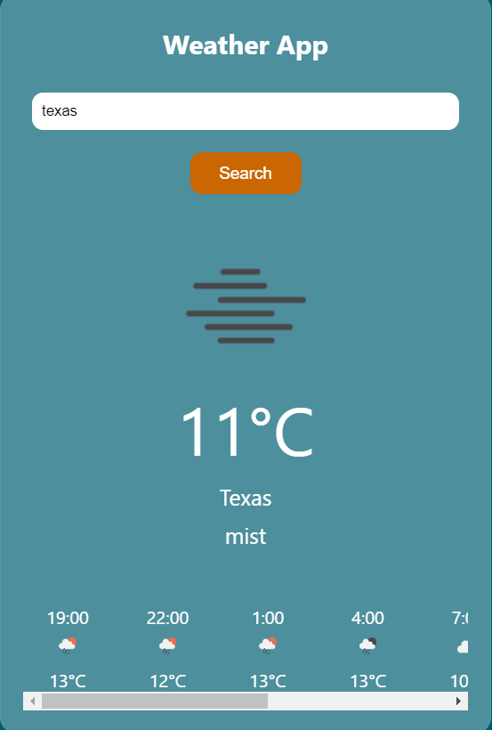

# Weather App

## Description
This Weather App allows users to search for the current weather and hourly forecast of a city using the OpenWeatherMap API.
Users can enter a city name, and the app will display the current temperature, weather description, and an hourly forecast for the next 24 hours.

## Usage
1. Enter the name of a city in the input field.
2. Click on the "Search" button.
3. The app will display the current temperature, weather description, and an hourly forecast for the next 24 hours.

## Features
- Current weather display including temperature and weather description.
- Hourly forecast for the next 24 hours.
- Responsive design for easy use on different devices.

## How to Run
1. Clone this repository to your local machine.
2. Open the `index.html` file in your web browser.
3. Enter a city name and click the "Search" button to see the weather information.

## Technologies Used
- HTML
- CSS
- JavaScript

## Preview

